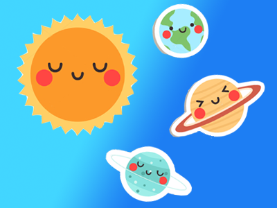
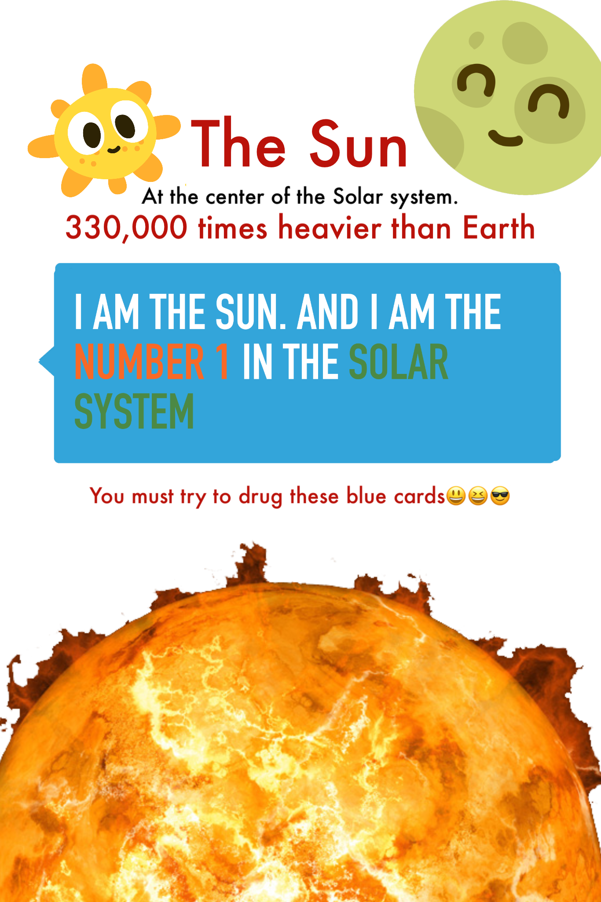
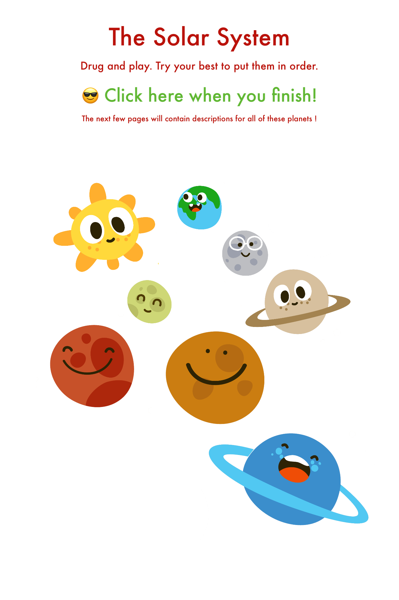
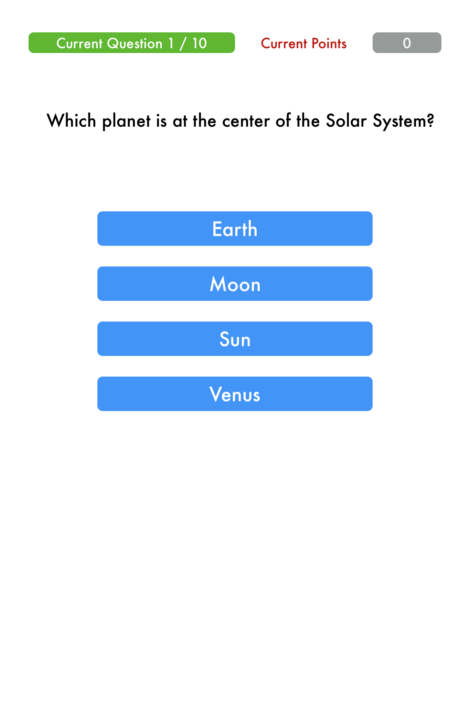

# Our Universe Playground for WWDC17

This is the playground submission for WWDC 2017 Scholarship by Shunzhe Ma. Our Universe is aimed to help kids learn basic knowledge about our solar system and have great fun exploring it with their friends! This playground uses Scenekit, UI Kit, Playground Support and some other features.
The playground will be uploaded soon.

All made by @ShunzheMa. A young iOS developer and a high school student.
Twitter: @shunzhema

